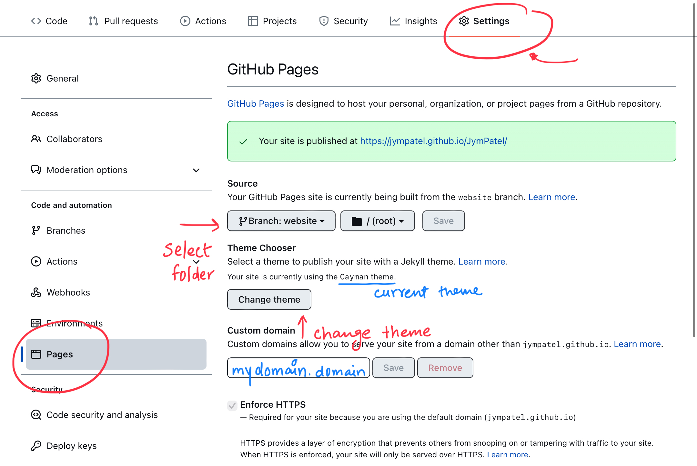
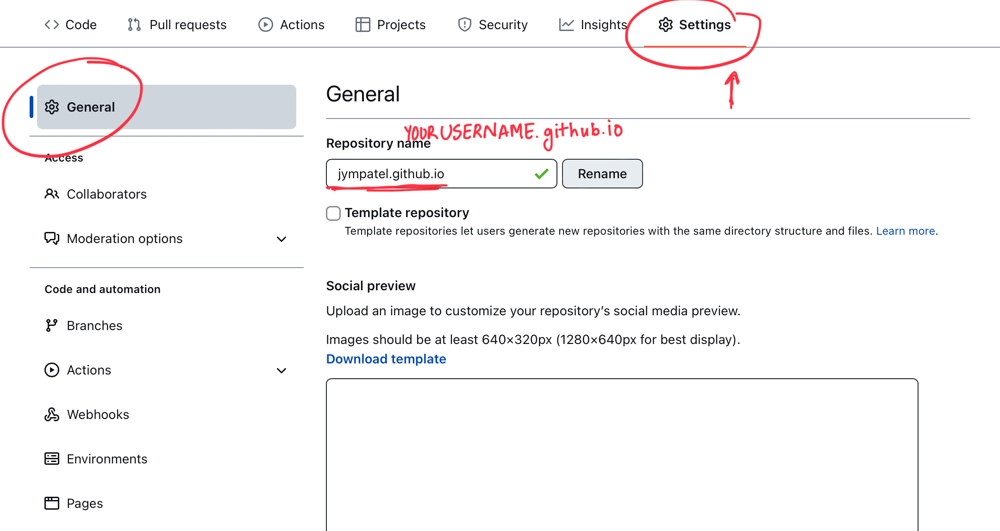

GitHub allows you to host web with GitHub Pages using jekyll.
Using jekyll it simply creates your site from markdown file in a theme you want.  
We would first look how to create a github page (your web), then we will see how to customize it.

### CREATING GITHUB PAGE
to create github page simply go to settings > github page > customise your preferences > create a web page
  
01. select the root folder for your web (root folder doesn't need to be root of your repo), by selecting branch it's in then folder. make sure that files your web will need like index.md will be accessed for this folder, deleting branch or folder will take your webpage down.  
02. select your desired theme from theme section.  
03. if you have your custom domain just place it.
04. visit USERNAME.github.io/REPONAME, but wait don't you want /REPONAME in your web then rename your repo to USERNAME.github.io (it's a special repo for pages, github pages from this repo are hosted at USERNAME.github.io)  
  

### MORE THINGS YOU CAN DO
#### changing _config.yml
```
# remove "VISIT ON GITHUB" button
github:
  is_project_page: false


# default title & description
title: DEFAULT_TITLE
description: DEFAULT_DESCRIPTION
```
#### to change title & description of subpage (should be markdown file) use commands of _config.yml in 3riple block
```
---
# this is your YAML block
# hashtags are comments in this block
title: SUBPAGE_TITLE
description: SUBPAGE_DESCRIPTION
---
# MAIN HEADING
THIS IS YOUR MAIN MARKDOWN PAGE
### hashtags are heading in your md file
```
### EVEN MORE CAN BE DONE VISIT WHAT YOU FIND INTERESTING
[Using Google Analysis or Microsoft Clarity with GitHub Pages](./../22.08.06/clarity_analaytics_gpage.md)  