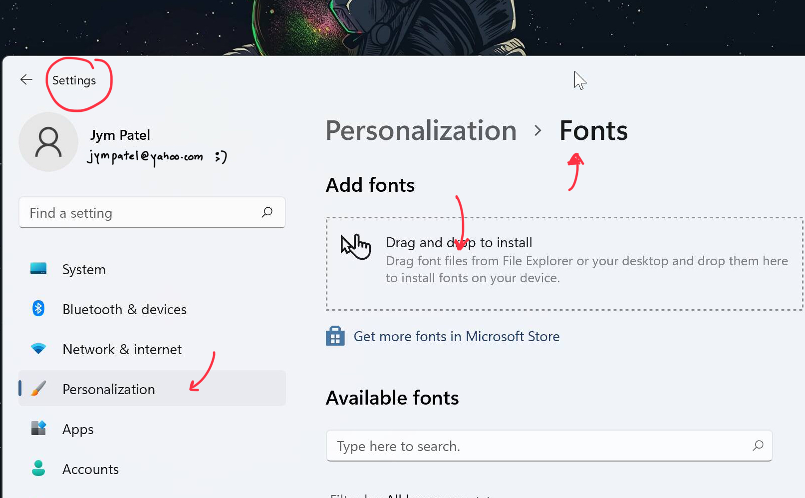

##### 08th March 2022

coming directly to the problem,  
  
to install jetbrains font to vs code we first need to install it on our os  
to do that download font zip from their [web](https://www.jetbrains.com/lp/mono/)  
now as mentioned in their web do as per your system.  
1. Windows 11 (this method will work better than as mentioned in their web)  
unzip file and drag fonts files (/fonts/variable/) to settings > personalization > fonts  

2. MacOS  
select all font files (/fonts/variable/) and double click on Install Fonts  
3. Linux  
Unpack fonts to ~/.local/share/fonts (or /usr/share/fonts, to install fonts system-wide) and fc-cache -f -v  
  
now to install font on vs code,  
go to settings in vs code > search "font" > in font family write "jetbrains mono" on starting of line (ex. jetbrains mono, monospace) not like (ex. monospace, jetbrains mono)  
  
now just check your editor

