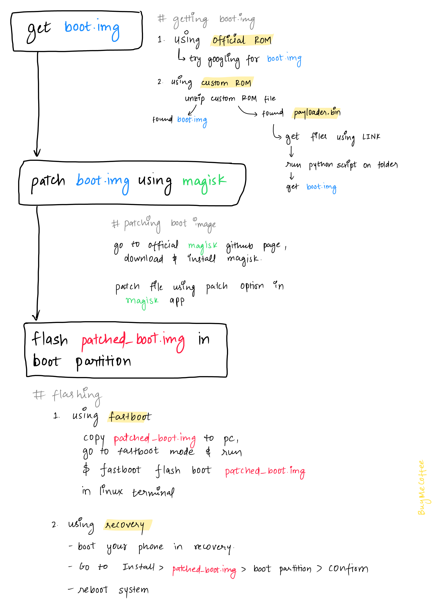

  

## getting boot.img  

### if you are using Official ROM  
try searching google for boot.img of your android device, boot images of Xiaomi devices caan be found easily.  

### if you are using Custom ROM  
unzip zip file of your custom ROM

## patching boot.img  

## flashing patched_boot.img  